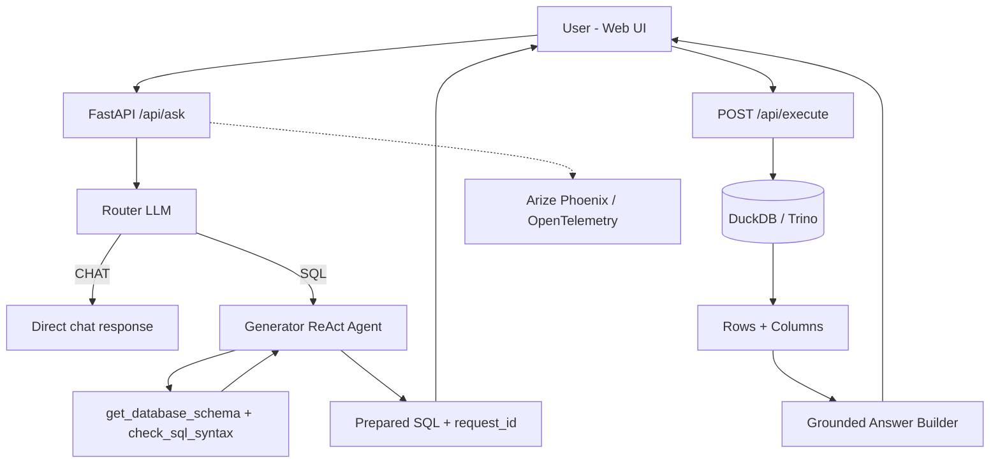

# Kur AI — Agentic Text-to-SQL Assistant

Kur AI giúp end-user (Analyst, Data Engineer, Product/Ops) hỏi dữ liệu bằng ngôn ngữ tự nhiên và nhận lại SQL + kết quả có kiểm soát.

Mục tiêu chính của hệ thống:
- Giảm thời gian viết SQL thủ công cho câu hỏi business.
- Tăng độ tin cậy bằng cơ chế **approval-first** (`ask` chuẩn bị SQL, `execute` mới chạy).
- Tránh trả lời “đoán” trước khi query chạy; câu trả lời business được build từ kết quả thực tế.

---

## 1) End-user Problem Kur đang giải quyết

Trong thực tế, user business thường gặp 3 vấn đề:
1. Không biết schema đủ sâu để tự viết SQL đúng.
2. Cần kết quả nhanh nhưng vẫn muốn kiểm soát query trước khi chạy.
3. Cần câu trả lời dễ hiểu, bám số liệu thật từ dữ liệu trả về.

Kur giải quyết bằng luồng:
- User hỏi tiếng Việt/English.
- Hệ thống chuẩn bị SQL (chưa chạy ngay).
- User duyệt query (Allow/Skip).
- Hệ thống execute và trả answer grounded theo dữ liệu trả về.

---

## 2) Kiến trúc hệ thống (Current)



### Thành phần chính
- **Frontend**: Vanilla HTML/CSS/JS, side-drawer settings, single-flow chat UI.
- **Backend**: FastAPI (`app/api.py`) với ask/execute/state/history.
- **Agent Layer**: LangGraph (`agent/graph.py`) với Router + Generator.
- **Execution**: DuckDB mặc định, Trino configurable.
- **Catalog**: Apache Polaris (headless REST catalog).
- **Observability**: OpenTelemetry + Arize Phoenix.

---

## 3) Luồng API cốt lõi

### `POST /api/ask`
- Classify nhanh câu hỏi:
    - schema-list / explain follow-up / SQL query / meta chat.
- Nếu ra SQL: trả về `requires_approval=true` và `request_id`.
- Thông điệp trước execute là trung tính (không đoán kết quả).

### `POST /api/execute`
- Nhận `request_id`, chạy SQL thật trên engine hiện hành.
- Trả `data`, `columns`, `latency_ms`.
- Tạo câu trả lời business từ dữ liệu thật (`_build_grounded_answer_from_result`).

---

## 4) Cấu trúc thư mục

```text
Kur/
├── app/
│   ├── api.py                    # FastAPI endpoints + flow orchestration
│   ├── core/config.py            # Settings defaults + env mapping
│   ├── models/api_models.py      # Request/response models
│   └── services/                 # History/Polaris/schema adapters
├── agent/
│   ├── graph.py                  # Router + Generator LangGraph flow
│   ├── tools/                    # schema + syntax tools
│   └── utils/                    # llm factory + timeout invoke
├── ui/
│   ├── index.html
│   ├── style.css
│   ├── app.js                    # bootstrap/theme/shared state
│   └── js/
│       ├── api.js
│       ├── chat.js
│       └── settings.js
├── scripts/
│   ├── 02_generate_data.py       # generate DuckDB demo data
│   └── setup_polaris.py          # create Polaris catalog
├── docker-compose.yml
├── Dockerfile
└── requirements.txt
```

---

## 5) Yêu cầu môi trường

### Bắt buộc
- Docker + Docker Compose plugin
- Git

### Tùy chọn (nếu chạy local không Docker)
- Python 3.11
- `pip`

---

## 6) Quick Start (khuyến nghị dùng Docker)

### Bước 1: Clone và vào project
```bash
git clone <your-repo-url>
cd Kur
```

### Bước 2: Tạo file `.env`
Bạn có thể copy từ `.env.example` rồi chỉnh lại, hoặc tạo mới với block tối thiểu dưới đây:

```bash
cat > .env << 'EOF'
ROUTER_PROVIDER=groq
ROUTER_MODEL=llama-3.1-8b-instant
ROUTER_API_KEY=

GENERATOR_PROVIDER=openai
GENERATOR_MODEL=gpt-4o
GENERATOR_API_KEY=

OLLAMA_BASE_URL=http://localhost:11434
OLLAMA_MODEL=snowflake-arctic-text2sql-r1:7b

DB_ENGINE=duckdb
DUCKDB_PATH=/app/data/kur.db

POLARIS_URL=http://polaris:8181
POLARIS_CATALOG=kur_polaris_catalog
POLARIS_CREDENTIALS=polaris:polaris_secret

PHOENIX_COLLECTOR_ENDPOINT=http://phoenix:6006/v1/traces
EOF
```

> Nếu chưa có API key ngay, hệ thống vẫn boot được nhưng các câu hỏi cần LLM sẽ lỗi cho tới khi bạn cấu hình key trong Settings UI hoặc `.env`.

### Bước 3: Build và chạy services
```bash
docker compose up -d --build
```

### Bước 4: (Khuyến nghị) tạo demo data DuckDB
```bash
docker compose run --rm kur-api python /app/scripts/02_generate_data.py
docker compose restart kur-api
```

### Bước 5: Khởi tạo Polaris catalog
```bash
python3 scripts/setup_polaris.py
```

### Bước 6: Mở các URL
- Kur UI: http://localhost:8501
- Kur API docs: http://localhost:8000/docs
- Phoenix traces: http://localhost:6006
- Polaris endpoint: http://localhost:8181

---

## 7) Smoke test nhanh

### Health
```bash
curl -s http://localhost:8000/api/health
```

### Ask (prepare SQL)
```bash
curl -s -X POST http://localhost:8000/api/ask \
    -H 'Content-Type: application/json' \
    -d '{"question":"Có bao nhiêu dòng dữ liệu trong bảng khách hàng?"}'
```

Kỳ vọng:
- Có `requires_approval: true`
- Có `request_id`
- Không trả lời phán đoán kết quả trước execute

### Execute
```bash
curl -s -X POST http://localhost:8000/api/execute \
    -H 'Content-Type: application/json' \
    -d '{"request_id":"<REQUEST_ID_FROM_ASK>"}'
```

Kỳ vọng:
- Trả `data` + `columns`
- `answer` bám dữ liệu query trả về

---

## 8) Chạy local (không Docker)

```bash
python3 -m venv .venv
source .venv/bin/activate
pip install -r requirements.txt

# optional: tạo data demo
python scripts/02_generate_data.py

# chạy API
uvicorn app.api:app --reload --port 8000

# chạy UI (khuyến nghị vẫn dùng container UI để có proxy /api)
docker compose up -d kur-ui
```

> Nếu bạn muốn chạy UI local bằng static server (`python -m http.server`), cần tự cấu hình proxy `/api` hoặc sửa `window.KurApp.API_URL` trong `ui/app.js` thành `http://localhost:8000`.

---

## 9) Lưu ý vận hành

- Polaris OSS là headless catalog, không có UI quản trị mặc định.
- UI static có no-cache headers cho HTML/CSS/JS để tránh stale assets.
- `PENDING_QUERIES` đang in-memory (TTL 1800s), nên restart API sẽ mất pending request.
- History chat được lưu ở SQLite (`data/history.db`).

---

## 10) Troubleshooting

### UI vẫn hiện trạng thái cũ sau khi deploy
```bash
docker compose build --no-cache kur-ui
docker compose up -d kur-ui
```
Hard refresh trình duyệt (`Ctrl+Shift+R`).

### `ask` báo lỗi quota/key
- Kiểm tra `ROUTER_API_KEY` / `GENERATOR_API_KEY`.
- Hoặc mở Settings trong UI để cấu hình lại provider/model/key.

### `execute` lỗi SQL
- Xem SQL trong response ask.
- Kiểm tra schema data đã generate chưa (`02_generate_data.py`).

### Không có dữ liệu
- Chạy lại script generate data:
```bash
docker compose run --rm kur-api python /app/scripts/02_generate_data.py
docker compose restart kur-api
```

---

## 11) Tech Stack

- Backend: FastAPI, Pydantic, DuckDB/Trino
- Agent: LangChain, LangGraph
- Frontend: Vanilla JS, Inter, Lucide, Nginx static serving
- Catalog: Apache Polaris
- Observability: Arize Phoenix + OpenTelemetry

---

## 12) Tài liệu liên quan

- UI As-built blueprint: `docs/frontend_blueprint.md`
- System current-state blueprint: `docs/latest_blueprint.md`
- Gap analysis: `docs/SINGLE_NODE_BLUEPRINT_GAP.md`
