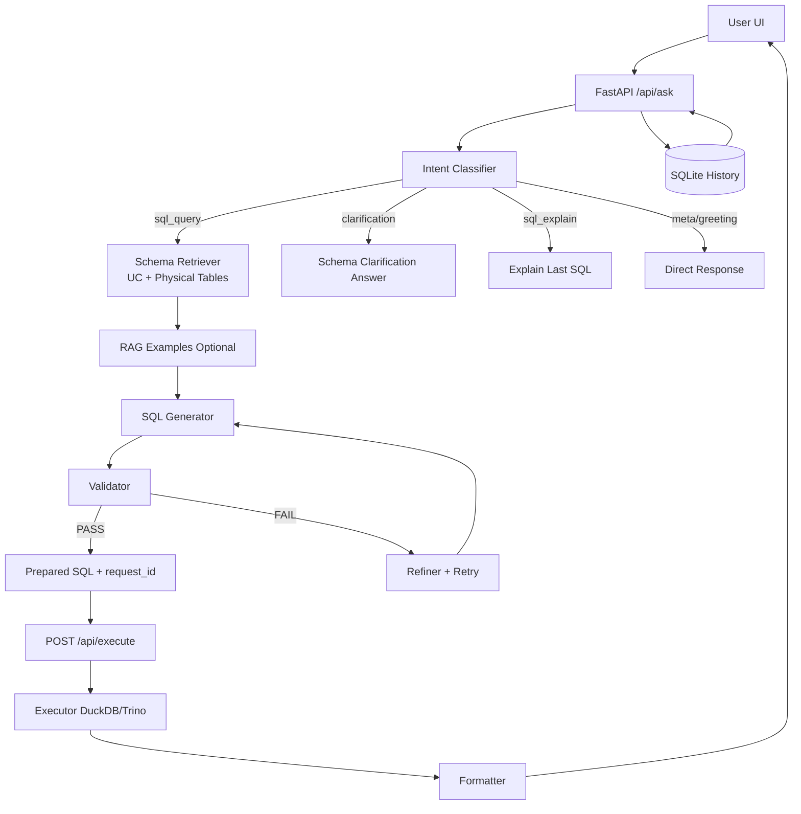
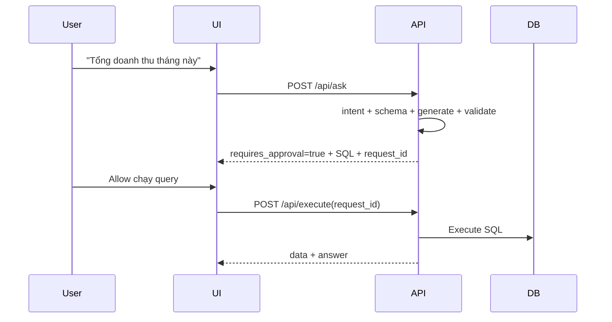
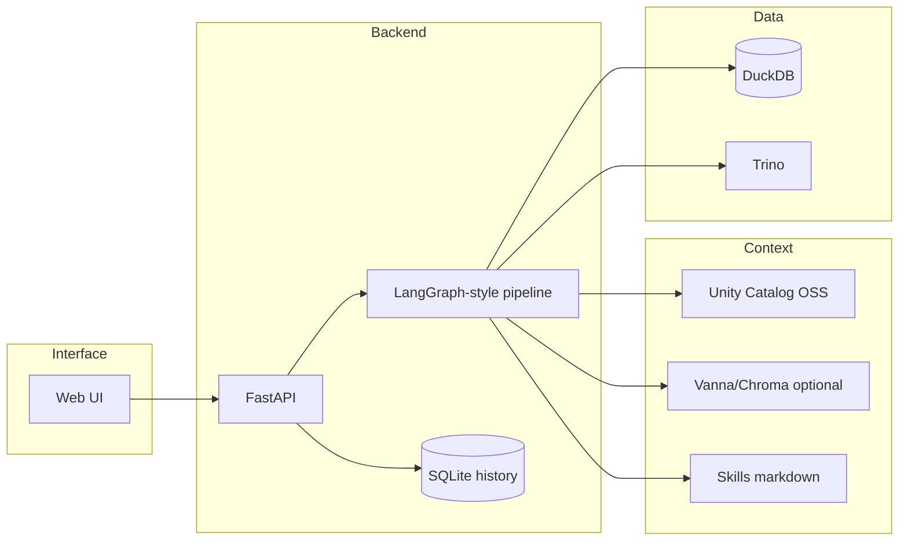

# 🔮 Kur — Agentic Text-to-SQL (DuckDB + Unity Catalog OSS + Trino-ready)

Kur là trợ lý dữ liệu kiểu Genie-lite:
- Hỏi tiếng Việt/English
- Chuẩn bị SQL có kiểm soát (Allow/Skip trước khi chạy)
- Thực thi và trả lời business-friendly
- Có lịch sử bền (persist sau reload)
- Có ngữ cảnh hội thoại gần nhất để hiểu follow-up

---

## 1) Kiến trúc hiện tại



---

## 2) Flow tương tác (2-phase execution)



---

## 3) Điểm mới đã fix

- Follow-up thông minh hơn:
  - Nhận diện intent `sql_explain` cho câu kiểu: “query trên tối ưu chưa?”, “giải thích câu SQL vừa rồi”.
  - Phân tích dựa trên **SQL gần nhất** trong lịch sử.
- Memory ngữ cảnh:
  - SQL generator nhận thêm `conversation_context` (các lượt gần nhất), nên bớt “mất ngữ cảnh”.
- Clarification chính xác:
  - Đếm bảng theo physical source-of-truth để không đếm trùng UC semantic section.
- History bền:
  - Lưu SQLite tại `data/history.db`, reload không mất.
  - Chống duplicate khi hỏi liên tiếp cùng câu trong cửa sổ thời gian ngắn.
- Root folder sạch hơn:
  - Log `.txt` được gom vào `log/archive/`.
  - Blueprint doc được đưa vào `docs/`.

---

## 4) Cấu trúc dự án (đã dọn)

```text
Kur/
├── api.py
├── graph.py
├── docker-compose.yml
├── Dockerfile
├── requirements.txt
├── README.md
│
├── nodes/
│   ├── intent.py
│   ├── schema_retriever.py
│   ├── rag_retriever.py
│   ├── sql_generator.py
│   ├── validator.py
│   ├── executor.py
│   ├── refiner.py
│   └── formatter.py
│
├── tools/
├── utils/
├── skills/
│   ├── writing-sql/SKILL.md
│   └── diagnose-error/SKILL.md
│
├── scripts/
│   ├── 02_generate_data.py
│   ├── setup_catalog.py
│   ├── train_rag.py
│   └── smoke_da_questions.py
│
├── ui/
│   ├── index.html
│   ├── style.css
│   ├── app.js
│   └── Dockerfile
│
├── trino/
│   └── catalog/
│       └── memory.properties
│
├── data/
│   ├── kur.db
│   ├── settings.json
│   └── history.db
│
├── docs/
│   └── SINGLE_NODE_BLUEPRINT_GAP.md
└── log/
    └── archive/
```

---

## 5) Chạy nhanh bằng Docker

### 5.1 Chuẩn bị

```bash
cd /data/DE/Kur

# tạo file env nếu chưa có
cp .env.example .env
```

### 5.2 Build + up

```bash
cd /data/DE/Kur
docker compose up -d --build
```

### 5.3 Kiểm tra dịch vụ đã lên

```bash
cd /data/DE/Kur
docker compose ps
curl -s http://localhost:8000/api/health
```

### 5.4 URLs

- Kur UI: http://localhost:8501
- Kur API: http://localhost:8000
- UC Server: http://localhost:8080
- UC UI: http://localhost:3000
- Trino Coordinator: http://localhost:8082

### 5.5 Seed dữ liệu (chỉ chạy khi DB rỗng hoặc cần reset)

```bash
cd /data/DE/Kur
# Dừng API để tránh lock file DuckDB
docker compose stop kur-api

# Recreate dữ liệu sample trong volume dùng chung
docker compose run --rm kur-api python /app/scripts/02_generate_data.py

# Chạy lại API
docker compose up -d kur-api

# kiểm tra lại
curl -s http://localhost:8000/api/health
```

---

## 6) Chạy local (không Docker)

```bash
cd /data/DE/Kur
conda create -n kur python=3.10 -y
conda activate kur
pip install -r requirements.txt

# tạo env nếu chưa có
cp .env.example .env

# tạo dữ liệu
python scripts/02_generate_data.py

# chạy API
uvicorn api:app --reload --port 8000

# UI static (terminal mới)
cd ui
python -m http.server 5173
```

UI local: http://localhost:5173

Health API local: http://localhost:8000/api/health

---

## 7) API hiện tại

| Method | Endpoint | Mục đích |
|---|---|---|
| GET | `/api/health` | Health + engine + số bảng |
| POST | `/api/ask` | Chuẩn bị SQL hoặc trả lời direct intent |
| POST | `/api/execute` | Execute SQL đã chuẩn bị (qua `request_id`) |
| GET | `/api/history` | Lấy lịch sử chat persist |
| DELETE | `/api/history` | Xóa lịch sử chat |
| GET | `/api/settings` | Đọc settings hiện tại |
| POST | `/api/settings` | Cập nhật settings |
| POST | `/api/settings/reset` | Reset settings |
| GET | `/api/schema` | Introspect schema |
| GET | `/api/suggestions` | Gợi ý câu hỏi |

### Ví dụ ask + execute

```bash
# 1) ask
curl -X POST http://localhost:8000/api/ask \
  -H "Content-Type: application/json" \
  -d '{"question":"Tổng doanh thu tháng này"}'

# 2) execute (dùng request_id từ bước 1)
curl -X POST http://localhost:8000/api/execute \
  -H "Content-Type: application/json" \
  -d '{"request_id":"<request-id>"}'
```

---

## 8) Cách Kur xử lý câu follow-up

Ví dụ user hỏi:
- “Giải thích câu query trên như vậy đã tối ưu chưa?”

Kur sẽ:
1. Classify thành `sql_explain`
2. Lấy SQL gần nhất từ lịch sử
3. Phân tích và trả lời theo dạng:
   - Query đang làm gì
   - Điểm tốt
   - Điểm cần tối ưu
   - SQL đề xuất (nếu cần)

Điều này giúp tránh bị lệch sang trả lời schema chung chung.

---

## 9) Engine support

### DuckDB (default)
- Nhanh, đơn giản cho single-node
- Phù hợp POC + demo analytics

### Trino (đã tích hợp)
- Có service Trino trong Docker
- API hỗ trợ execute/health/schema cho mode `db_engine=trino`
- Dùng để thử multi-engine path

---

## 10) Test nhanh chất lượng câu hỏi DA

Script smoke test:

```bash
cd /data/DE/Kur
python3 scripts/smoke_da_questions.py
```

Bộ câu hỏi bao gồm:
- Clarification schema
- Tổng doanh thu tháng này
- Top khách hàng chi tiêu
- Doanh thu theo khu vực
- Sản phẩm bán chạy
- Tỷ lệ đơn hàng hủy
- So sánh Q1/Q2
- Trung bình giá trị đơn hàng

---

## 11) Mermaid tổng quan thành phần



---

## 12) Tài liệu liên quan

- Gap review và roadmap: `docs/SINGLE_NODE_BLUEPRINT_GAP.md`
- Skill SQL prompt: `skills/writing-sql/SKILL.md`
- Script tạo dữ liệu: `scripts/02_generate_data.py`

---

## 13) Lưu ý production

- Dù đã tốt hơn về context, đây vẫn là POC-level agentic app.
- Muốn “thông minh ổn định kiểu production”, cần thêm:
  - Semantic layer chính thức (metric definitions)
  - Golden queries + evaluation pipeline
  - Observability/metrics + tracing chuẩn
  - RBAC và security policy sâu hơn

---

## 14) So sánh nhanh: Kur hiện tại vs Genie

> Phạm vi so sánh: bản Kur single-node hiện tại, đối chiếu theo reverse-engineering tài liệu Genie.

| Hạng mục | Kur hiện tại | Genie (theo reverse engineering) | GAP chính |
|---|---|---|---|
| Core pattern | Agentic Text-to-SQL pipeline | Tool-calling agent + skills | Tương đồng kiến trúc lõi |
| Tooling | Tool nội bộ cho schema/sql/exec/history | ~14 tools page-specific | Kur ít tool platform-level hơn |
| Routing | Intent-based trong 1 app | Chủ yếu page-based agent routing | Kur chưa có multi-page handoff như `openAsset` |
| Metadata | UC OSS + physical introspection | UC tools sâu hơn (`readTable`, `tableSearch`, insights/lineage) | Kur thiếu lineage/insights mức platform |
| Execution safety | 2-phase Ask/Execute (Allow/Skip) | Execute tool trực tiếp trong context page | Kur đã có control tốt cho POC |
| Memory | SQLite chat history + recent context | Context theo page/asset + platform state | Kur chưa có context sâu theo asset/page |
| Skills | Markdown skills cục bộ | Skills markdown load theo nhu cầu | Tương đồng, Kur cần mở rộng skill coverage |
| Observability | Mức cơ bản | Tích hợp sâu trong platform | Kur thiếu metrics/tracing chuẩn production |
| UX | Web app đơn giản, no flow trace | UX tích hợp workspace-native | Kur thiếu polished workflow liên trang |

### Kết luận ngắn
- Với scope single-node, Kur đã đạt được phần lõi quan trọng: hiểu câu hỏi, chuẩn bị SQL có approval, execute đa engine, giữ context cơ bản.
- GAP lớn nhất so với Genie nằm ở **deep platform integration** (lineage/insights/page context), **observability**, và **production governance**.

---

Nếu bạn muốn, bước tiếp theo mình có thể làm luôn:
1) thêm semantic model YAML cho domain Sales,
2) map synonym business terms,
3) bật chế độ “trusted query” cho các câu hỏi hay gặp.
